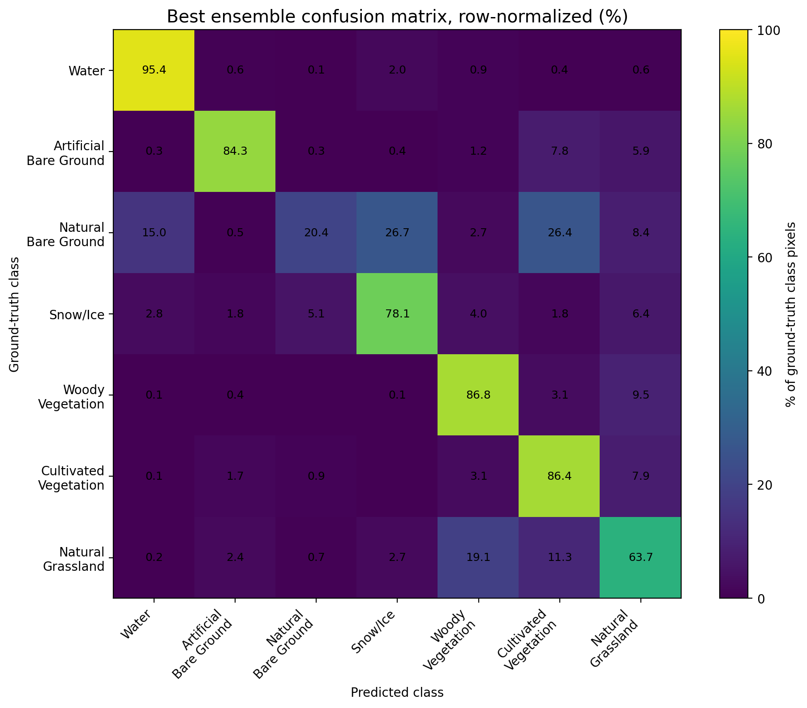

# Sentinel-2 Land Cover Segmentation with Residual U-Net, Pretrained Models, and Ensemble Prediction

This repository contains a deep learning mini-research project for **semantic segmentation of land cover classes** from Sentinel-2 imagery. The current stage of the project includes:

1. preprocessing LandCoverNet Europe 2018 data into summer median Sentinel-2 composites;
2. training a custom Residual U-Net baseline;
3. comparing it with ImageNet-pretrained segmentation models and TorchGeo Sentinel-2 pretrained models;
4. evaluating all models using pixel-level segmentation metrics;
5. building and evaluating an ensemble based on soft probability averaging;
6. visualizing predictions from individual models and the best ensemble.

The main selection metric is **mean Intersection over Union (mIoU)**.

---

## Dataset

The source dataset is **LandCoverNet Europe 2018**, part of the LandCoverNet global land-cover classification training dataset.

- Dataset DOI: <https://doi.org/10.34911/rdnt.63fxe5>
- Source page: <https://source.coop/radiantearth/landcovernet/landcovernet_eu>

LandCoverNet provides land-cover labels for multi-spectral satellite imagery from Sentinel-1, Sentinel-2, and Landsat-8 for 2018. In this project, the experiments use Sentinel-2 imagery and LandCoverNet labels for Europe.

### Classes

The original LandCoverNet labels were remapped for training as follows:

| Original label | Train ID | Class                  |
|----------------|----------|------------------------|
| 0              | 255      | Ignore / no data       |
| 1              | 0        | Water                  |
| 2              | 1        | Artificial Bare Ground |
| 3              | 2        | Natural Bare Ground    |
| 4              | 3        | Permanent Snow and Ice |
| 5              | 4        | Woody Vegetation       |
| 6              | 5        | Cultivated Vegetation  |
| 7              | 6        | Natural Grassland      |

### Pixel class distribution

The following distribution was used for class-frequency weighting experiments. Values are calculated over valid labeled pixels.

| Train ID | Class                  | Pixel fraction | Pixel percent |
|----------|------------------------|----------------|---------------|
| 0        | Water                  | 0.046550       | 4.6%          |
| 1        | Artificial Bare Ground | 0.054580       | 5.4%          |
| 2        | Natural Bare Ground    | 0.010020       | 1.0%          |
| 3        | Permanent Snow and Ice | 0.014138       | 1.4%          |
| 4        | Woody Vegetation       | 0.265378       | 26.5%         |
| 5        | Cultivated Vegetation  | 0.371394       | 37.1%         |
| 6        | Natural Grassland      | 0.237867       | 23.8%         |

The dataset is strongly imbalanced. The rarest valid classes are **Natural Bare Ground** and **Permanent Snow and Ice**.

---

## Processed datasets

The raw LandCoverNet data was converted into summer median Sentinel-2 composites. The preprocessing pipeline:

1. uses scenes from **June, July, and August**;
2. applies cloud / shadow / snow masking using the Sentinel-2 Scene Classification Layer (SCL);
3. computes a per-pixel median composite;
4. saves processed GeoTIFF images and masks.

Bad SCL classes removed during preprocessing:

| SCL ID | Meaning                  |
|--------|--------------------------|
| 0      | No data                  |
| 1      | Saturated / defective    |
| 3      | Cloud shadows            |
| 8      | Cloud medium probability |
| 9      | Cloud high probability   |
| 10     | Thin cirrus              |
| 11     | Snow / ice               |

Three processed dataset variants were used:

| Dataset                     | Bands                                                           | Channels | Image shape    | Purpose                                |
|-----------------------------|-----------------------------------------------------------------|----------|----------------|----------------------------------------|
| 4-band                      | B02, B03, B04, B08                                              | 4        | 4 × 256 × 256  | Early baseline                         |
| 10-band                     | B02, B03, B04, B08, B05, B06, B07, B8A, B11, B12                | 10       | 10 × 256 × 256 | Main dataset for custom and SMP models |
| TorchGeo-compatible 13-band | B01, B02, B03, B04, B05, B06, B07, B08, B8A, B09, B10, B11, B12 | 13       | 13 × 256 × 256 | TorchGeo Sentinel-2 pretrained models  |

For the TorchGeo-compatible dataset, `B10` is a zero-filled synthetic channel because the raw LandCoverNet Sentinel-2 data did not include this band.

---

## Project structure

```text
src/
├── dataset.py
├── evaluate.py
├── losses.py
├── metrics.py
├── model.py
├── model_factory.py
├── model_torchgeo.py
└── train.py

scripts/
├── prepare_landcovernet_median_dataset_multiband.py
├── inspect_processed_dataset.py
├── check_processed_dataset.py
├── visualize_model_comparison.py
└── ensemble_predict_test.py

data/
├── outputs/
│   └── processed_dataset_check.csv
└── figures/
    ├── comparison_8_samples_with_best_ensemble_seed42.png
    ├── comparison_8_samples_with_best_ensemble_seed1707.png
    ├── comparison_8_samples_with_best_ensemble_seed1736.png
    └── comparison_8_samples_with_best_ensemble_seed1777.png
```

---

## Model architectures

### Custom Residual U-Net

The main custom architecture is a Residual U-Net inspired by the original U-Net encoder-decoder structure with skip connections:

- U-Net reference: <https://arxiv.org/abs/1505.04597>

The implemented model uses:

- encoder blocks with `ResidualDoubleConv`;
- bottleneck with residual convolutional block;
- decoder blocks with transposed convolutions and skip connections;
- final `1×1` convolution for 7-class semantic segmentation.

The strongest custom configuration used:

```text
base_features = 64
features = (64, 128, 256, 512)
dropout_encoder = (0.0, 0.05, 0.1, 0.2)
dropout_bottleneck = 0.3
dropout_decoder = (0.2, 0.1, 0.05, 0.0)
```

### ImageNet-pretrained segmentation models

Several pretrained segmentation models were tested via `segmentation_models_pytorch`:

- Library: <https://github.com/qubvel-org/segmentation_models.pytorch>
- Documentation: <https://smp.readthedocs.io/en/latest/models.html>

Models used:

| Model      | Encoder             | Pretraining |
|------------|---------------------|-------------|
| DeepLabV3+ | ResNet34 / ResNet50 | ImageNet    |
| U-Net++    | EfficientNet-B3     | ImageNet    |
| FPN        | EfficientNet-B3     | ImageNet    |

References:

- DeepLabV3+: <https://arxiv.org/abs/1802.02611>
- U-Net++: <https://arxiv.org/abs/1807.10165>
- Feature Pyramid Networks: <https://arxiv.org/abs/1612.03144>

### TorchGeo Sentinel-2 pretrained model

A TorchGeo pretrained ResNet50 encoder was also tested:

- TorchGeo repository: <https://github.com/torchgeo/torchgeo>
- TorchGeo model documentation: <https://torchgeo.readthedocs.io/en/v0.7.0/api/models.html>
- TorchGeo pretrained weights tutorial: <https://torchgeo.readthedocs.io/en/v0.6.1/tutorials/pretrained_weights.html>

The best TorchGeo setup used:

```text
TorchGeo ResNet50 encoder
weights = SENTINEL2_ALL_DINO
input channels = 13
normalization = reflectance
decoder/head LR = 1e-3
encoder LR = 1e-4
```

The encoder is combined with a lightweight custom U-Net-like decoder.

---

## Loss function

The main loss function is a weighted combination of Focal Loss and Dice Loss:

```text
ComboLoss = focal_weight × FocalLoss + dice_weight × DiceLoss
```

The best general setting was:

```text
focal_weight = 0.2
dice_weight  = 0.8
gamma = 2.0
ignore_index = 255
```

Some experiments additionally used class-frequency alpha weights for Focal Loss.

---

## Metrics

The following metrics were used:

| Metric         | Meaning                                       |
|----------------|-----------------------------------------------|
| Pixel Accuracy | Fraction of correctly classified valid pixels |
| IoU per class  | Intersection over Union for each class        |
| Mean IoU       | Average IoU over valid classes                |
| Dice per class | Dice coefficient for each class               |
| Mean Dice      | Average Dice over valid classes               |

The main model-selection metric was **Mean IoU (mIoU)** because it is more robust than pixel accuracy under class imbalance.

---

## Experiments

All experiments were evaluated on the same 70/15/15 train/validation/test split with `seed=42`.

### Full experiment table

| Exp | Dataset | Model                   | Main setup                                            | Test Acc | Test mIoU | Test mDice | Notes                                       |
|-----|---------|-------------------------|-------------------------------------------------------|----------|-----------|------------|---------------------------------------------|
| 1   | 4-band  | ResUNet                 | no crop, no alpha, Focal/Dice 0.5/0.5, 30 epochs      | 0.7028   | 0.4650    | 0.5887     | baseline                                    |
| 2   | 4-band  | ResUNet                 | crop224, no alpha, 0.5/0.5                            | 0.7247   | 0.4783    | 0.5955     | crop improved result                        |
| 3   | 4-band  | ResUNet                 | crop224, alpha, 0.5/0.5                               | 0.6949   | 0.4871    | 0.6144     | alpha improved mIoU/mDice                   |
| 4   | 4-band  | ResUNet                 | crop192, alpha, 0.5/0.5                               | 0.7002   | 0.4893    | 0.6152     | crop192 better than crop224                 |
| 5   | 4-band  | ResUNet                 | crop128, alpha, 0.5/0.5                               | 0.6859   | 0.4891    | 0.6154     | close to exp4                               |
| 6   | 4-band  | ResUNet                 | crop192, alpha, 0.4/0.6                               | 0.6955   | 0.4833    | 0.6105     | worse                                       |
| 7   | 4-band  | ResUNet                 | crop192, alpha, 0.3/0.7                               | 0.7123   | 0.4900    | 0.6145     | better than exp6                            |
| 8   | 4-band  | ResUNet                 | crop192, alpha, 0.2/0.8                               | 0.7180   | 0.4947    | 0.6167     | best 4-band                                 |
| 9   | 4-band  | ResUNet                 | crop192, alpha, 0.1/0.9                               | 0.7077   | 0.4886    | 0.6156     | too much Dice weight                        |
| 10  | 10-band | ResUNet f32             | alpha, crop192, 0.2/0.8                               | 0.7618   | 0.5445    | 0.6723     | strong gain from 10 bands                   |
| 11  | 10-band | ResUNet f32             | alpha, crop192, 0.5/0.5                               | 0.7439   | 0.5280    | 0.6591     | worse than Dice-heavy                       |
| 12  | 10-band | ResUNet f32             | no alpha, crop192, 0.2/0.8                            | 0.7524   | 0.5482    | 0.6750     | no alpha improved mIoU                      |
| 13  | 10-band | ResUNet f48             | no alpha, crop192, 0.2/0.8                            | 0.7523   | 0.5384    | 0.6655     | wider model did not help                    |
| 14  | 10-band | ResUNet f64             | no alpha, crop192, 0.2/0.8                            | 0.7612   | 0.5479    | 0.6778     | wider, but no clear gain                    |
| 15  | 10-band | ResUNet f64             | no alpha, crop192, stronger dropout, 0.2/0.8          | 0.7573   | 0.5536    | 0.6827     | best early custom model                     |
| 16  | 10-band | ResUNet f64             | no alpha, crop224, stronger dropout, 0.2/0.8          | 0.7583   | 0.5498    | 0.6826     | crop224 slightly worse                      |
| 17  | 10-band | ResUNet f64             | repeat of exp15 after model factory changes           | 0.7599   | 0.5486    | 0.6766     | reproducibility check                       |
| 18  | 10-band | DeepLabV3+              | ResNet34, ImageNet, crop192, no alpha, 0.2/0.8        | 0.7412   | 0.5117    | 0.6324     | weaker than ResUNet                         |
| 19  | 10-band | U-Net++                 | EfficientNet-B3, ImageNet, crop192, no alpha, 0.2/0.8 | 0.7605   | 0.5365    | 0.6571     | best ImageNet-pretrained baseline           |
| 20  | 10-band | FPN                     | EfficientNet-B3, ImageNet, crop192, no alpha, 0.2/0.8 | 0.7588   | 0.5104    | 0.6336     | useful diversity for ensemble               |
| 21  | 10-band | DeepLabV3+              | ResNet50, ImageNet, crop192, no alpha, 0.2/0.8        | 0.7413   | 0.5237    | 0.6470     | better than ResNet34 variant                |
| 22  | 13-band | ResUNet f64             | TorchGeo-compatible bands, reflectance norm           | 0.7516   | 0.5429    | 0.6706     | 13 bands alone did not improve custom model |
| 23  | 13-band | TorchGeo ResNet50 U-Net | Sentinel-2 ALL DINO, same LR                          | 0.7457   | 0.5198    | 0.6395     | weak baseline                               |
| 24  | 13-band | TorchGeo ResNet50 U-Net | Sentinel-2 ALL DINO, encoder LR 1e-4, decoder LR 1e-3 | 0.7846   | 0.5602    | 0.6815     | best single model overall                   |
| 25  | 13-band | TorchGeo ResNet50 U-Net | separate LR + TorchGeo S2 stats norm                  | 0.7697   | 0.5404    | 0.6561     | S2 stats norm hurt                          |
| 26  | 13-band | TorchGeo ResNet50 U-Net | separate LR + S2 stats norm + freeze encoder 5 epochs | 0.7751   | 0.5391    | 0.6495     | freezing did not help                       |
| 27  | 13-band | TorchGeo ResNet50 U-Net | separate LR + reflectance norm + class alpha          | 0.7742   | 0.5583    | 0.6815     | improved rare class vs exp24                |

---

## Main findings from individual models

1. Adding more Sentinel-2 bands was the largest improvement.  
   The best 4-band model reached `mIoU = 0.4947`, while the best 10-band custom model reached `mIoU = 0.5536`.

2. The custom Residual U-Net remained competitive.  
   ImageNet-pretrained segmentation models did not outperform the best custom Residual U-Net.

3. TorchGeo Sentinel-2 pretraining helped, but only with careful fine-tuning.  
   Using a lower learning rate for the pretrained encoder and a higher learning rate for the decoder/head was important.

4. TorchGeo S2 mean/std normalization did not help in this setup.  
   Simple reflectance normalization performed better for the processed summer median composites.

5. Class alpha improved some rare-class behavior but did not improve the best overall mIoU.

---

## Ensemble prediction

After evaluating individual models, several ensemble strategies were tested.

Candidate models:

| Exp | Model                   | Input   |
|-----|-------------------------|---------|
| 22  | ResUNet 13-band         | 13-band |
| 27  | TorchGeo DINO alpha     | 13-band |
| 19  | U-Net++ EfficientNet-B3 | 10-band |
| 21  | DeepLabV3+ ResNet50     | 10-band |
| 20  | FPN EfficientNet-B3     | 10-band |

For the same chip, both 10-band and 13-band inputs are loaded. Each model predicts logits or masks on the same spatial grid.

### Tested ensemble methods

| Method                     | Description                                                                                                        |
|----------------------------|--------------------------------------------------------------------------------------------------------------------|
| Majority voting            | Each model votes for one class per pixel                                                                           |
| Weighted hard voting       | Each model vote is weighted by its test mIoU                                                                       |
| Class-aware hard voting    | Each model vote for class `c` is weighted by the model's class-specific IoU for class `c`                          |
| Soft probability averaging | Model logits are converted to probabilities with softmax; probabilities are averaged with model-level mIoU weights |

The best method was **weighted soft probability averaging**.

### Ensemble results

| Models                                | Strategy    | Pixel Acc  | mIoU       | mDice      |
|---------------------------------------|-------------|------------|------------|------------|
| exp22 + exp27                         | majority    | 0.7652     | 0.5538     | 0.6826     |
| exp22 + exp27                         | weighted    | 0.7742     | 0.5583     | 0.6815     |
| exp22 + exp27                         | class-aware | 0.7652     | 0.5389     | 0.6628     |
| exp22 + exp27                         | soft_avg    | 0.7777     | 0.5606     | 0.6851     |
| exp22 + exp27 + exp19                 | majority    | 0.7779     | 0.5651     | 0.6906     |
| exp22 + exp27 + exp19                 | weighted    | 0.7784     | 0.5640     | 0.6879     |
| exp22 + exp27 + exp19                 | class-aware | 0.7776     | 0.5472     | 0.6621     |
| exp22 + exp27 + exp19                 | soft_avg    | 0.7850     | 0.5707     | 0.6950     |
| exp22 + exp27 + exp19 + exp21         | majority    | 0.7791     | 0.5669     | 0.6924     |
| exp22 + exp27 + exp19 + exp21         | weighted    | 0.7790     | 0.5676     | 0.6928     |
| exp22 + exp27 + exp19 + exp21         | class-aware | 0.7770     | 0.5471     | 0.6620     |
| exp22 + exp27 + exp19 + exp21         | soft_avg    | 0.7867     | 0.5711     | 0.6945     |
| exp22 + exp27 + exp19 + exp21 + exp20 | majority    | 0.7877     | 0.5746     | 0.6994     |
| exp22 + exp27 + exp19 + exp21 + exp20 | weighted    | 0.7880     | 0.5752     | 0.6999     |
| exp22 + exp27 + exp19 + exp21 + exp20 | class-aware | 0.7821     | 0.5399     | 0.6568     |
| exp22 + exp27 + exp19 + exp21 + exp20 | soft_avg    | **0.7938** | **0.5816** | **0.7064** |

### Best ensemble

The best final ensemble is:

```text
Models:
exp22 + exp27 + exp19 + exp21 + exp20

Strategy:
weighted soft probability averaging

Result:
Pixel Acc = 0.7938
mIoU      = 0.5816
mDice     = 0.7064
```

Compared with the best single model from the final set, `exp27`:

| Model                  | Pixel Acc  | mIoU       | mDice      |
|------------------------|------------|------------|------------|
| exp27                  | 0.7742     | 0.5583     | 0.6815     |
| Best ensemble soft_avg | **0.7938** | **0.5816** | **0.7064** |
| Improvement            | +0.0196    | +0.0233    | +0.0249    |

### Best ensemble per-class metrics

The final selected ensemble was evaluated per class as follows:

| Train ID | Class                  | IoU    | Dice   |
|----------|------------------------|--------|--------|
| 0        | Water                  | 0.8517 | 0.9199 |
| 1        | Artificial Bare Ground | 0.6946 | 0.8198 |
| 2        | Natural Bare Ground    | 0.1589 | 0.2742 |
| 3        | Permanent Snow and Ice | 0.3947 | 0.5660 |
| 4        | Woody Vegetation       | 0.6864 | 0.8140 |
| 5        | Cultivated Vegetation  | 0.7662 | 0.8676 |
| 6        | Natural Grassland      | 0.5187 | 0.6830 |

The remaining weakness is the rare `Natural Bare Ground` class. However, the ensemble improves several important classes compared with the best single model, including `Cultivated Vegetation`, `Natural Grassland`, and `Permanent Snow and Ice`.

### Confusion matrix

For interpretability, the final ensemble confusion matrix is visualized as a row-normalized percentage matrix. Each row corresponds to the ground-truth class and sums to 100%. Therefore, the diagonal shows the percentage of pixels from each true class that were correctly classified, while off-diagonal cells show where each class was confused.



The class-aware hard voting strategy did not work well. It was too sensitive to hard class decisions and significantly degraded the rare `Natural Bare Ground` class. In contrast, soft probability averaging preserved confidence information and produced the best overall segmentation quality.

---

## Prediction visualizations

The following figures compare:

1. RGB composite;
2. ground-truth mask;
3. predictions from individual models;
4. best ensemble prediction using weighted soft probability averaging.

Figures are stored in `data/figures/`.

### Seed 1707


### Seed 1736


### Seed 1777


Qualitatively, the ensemble tends to produce smoother and more stable predictions than individual models, while preserving useful minority-class regions in several examples.

---

## Current conclusion

At the current stage, the best result is obtained not by a single model, but by a heterogeneous ensemble that combines:

- a custom Residual U-Net trained on 13-band data;
- a TorchGeo Sentinel-2 DINO pretrained model;
- three ImageNet-pretrained segmentation architectures trained on 10-band Sentinel-2 composites.

The final weighted soft probability ensemble achieved:

```text
Pixel Accuracy = 0.7938
Mean IoU       = 0.5816
Mean Dice      = 0.7064
```

This is the strongest result of the project so far.

---
