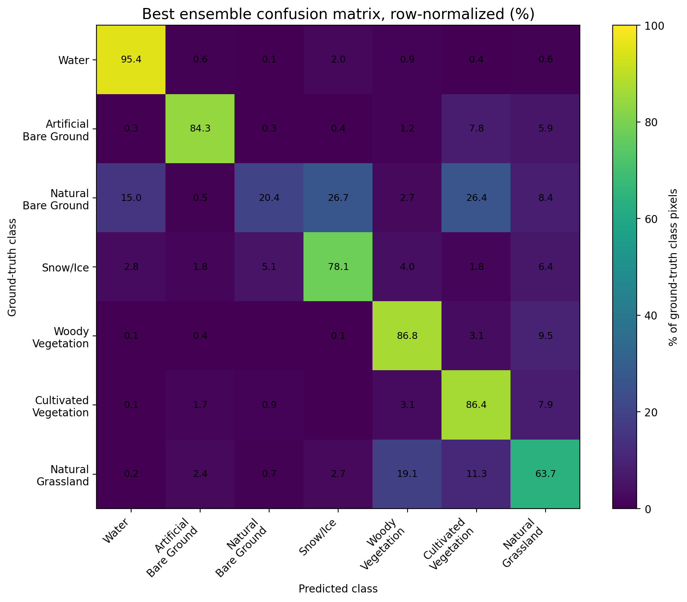
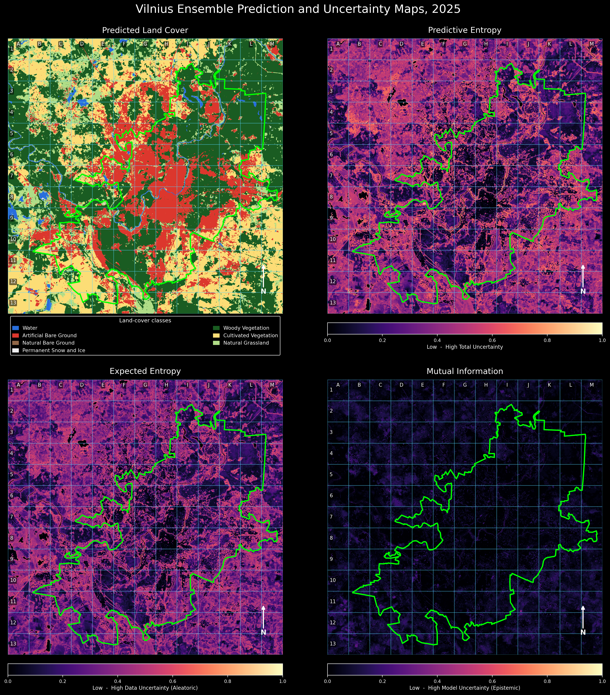

# Sentinel-2 Land Cover Segmentation with Residual U-Net, Pretrained Models, and Ensemble Prediction

This repository contains a deep learning mini-research project on **semantic segmentation of land-cover classes from Sentinel-2 imagery**. The project combines model development, experimental comparison, ensemble prediction, and an applied case study focused on the spatial development of Vilnius.

The main research objective is to estimate **how the land cover of Vilnius changes over time** by applying deep learning segmentation models to Sentinel-2 summer median composites from different years. In particular, the project investigates whether urban expansion can be detected from satellite imagery and which land-cover classes are most affected by this change.

To support this objective, the work follows two connected directions. First, several segmentation models are trained and evaluated on the processed LandCoverNet Europe 2018 dataset. This includes a fully custom Residual U-Net, ImageNet-pretrained segmentation architectures, and a remote-sensing-specific TorchGeo Sentinel-2 pretrained model. Second, the best-performing models are combined into an ensemble and applied to real Sentinel-2 imagery over Vilnius for 2015, 2020, and 2025.

The main model selection metric is **mean Intersection over Union (mIoU)**, while additional metrics such as pixel accuracy, Dice score, and per-class IoU are used for detailed analysis.

The project includes the following main tasks:

1. Prepare LandCoverNet Europe 2018 data as summer median Sentinel-2 composites.
2. Develop and train a fully custom Residual U-Net segmentation model.
3. Fine-tune general-purpose pretrained segmentation models on the processed dataset.
4. Fine-tune a remote-sensing-specific model using TorchGeo Sentinel-2 pretrained weights.
5. Compare individual models using validation and test segmentation metrics.
6. Build and evaluate an ensemble prediction strategy based on soft probability averaging.
7. Apply the selected ensemble to Sentinel-2 imagery over Vilnius for multiple years.
8. Estimate land-cover class shares and analyze urban development trends over time.

---

## Dataset

The source dataset is **LandCoverNet Europe 2018**, part of the LandCoverNet global land-cover classification training dataset [[1]](#ref1).

- Dataset DOI: <https://doi.org/10.34911/rdnt.63fxe5>
- Source page: <https://source.coop/radiantearth/landcovernet/landcovernet_eu>

LandCoverNet provides land-cover labels for multi-spectral satellite imagery from Sentinel-1, Sentinel-2, and Landsat-8 for 2018. In this project, the experiments use Sentinel-2 imagery and LandCoverNet labels for Europe.

### Classes

The original LandCoverNet labels were remapped for training as follows:

| Original label | Train ID | Class                  |
|----------------|----------|------------------------|
| 0              | 255      | Ignore / no data       |
| 1              | 0        | Water                  |
| 2              | 1        | Artificial Bare Ground |
| 3              | 2        | Natural Bare Ground    |
| 4              | 3        | Permanent Snow and Ice |
| 5              | 4        | Woody Vegetation       |
| 6              | 5        | Cultivated Vegetation  |
| 7              | 6        | Natural Grassland      |

### Pixel class distribution

The following distribution was used for class-frequency weighting experiments. Values are calculated over valid labeled pixels.

| Train ID | Class                  | Pixel fraction | Pixel percent |
|----------|------------------------|----------------|---------------|
| 0        | Water                  | 0.046550       | 4.6%          |
| 1        | Artificial Bare Ground | 0.054580       | 5.4%          |
| 2        | Natural Bare Ground    | 0.010020       | 1.0%          |
| 3        | Permanent Snow and Ice | 0.014138       | 1.4%          |
| 4        | Woody Vegetation       | 0.265378       | 26.5%         |
| 5        | Cultivated Vegetation  | 0.371394       | 37.1%         |
| 6        | Natural Grassland      | 0.237867       | 23.8%         |

The dataset is strongly imbalanced. The rarest valid classes are **Natural Bare Ground** and **Permanent Snow and Ice**.

---

## Processed datasets

The raw LandCoverNet data was converted into summer median Sentinel-2 composites. The preprocessing pipeline:

1. uses scenes from **June, July, and August**;
2. applies cloud / shadow / snow masking using the Sentinel-2 Scene Classification Layer (SCL);
3. computes a per-pixel median composite;
4. saves processed GeoTIFF images and masks.

Bad SCL classes removed during preprocessing:

| SCL ID | Meaning                  |
|--------|--------------------------|
| 0      | No data                  |
| 1      | Saturated / defective    |
| 3      | Cloud shadows            |
| 8      | Cloud medium probability |
| 9      | Cloud high probability   |
| 10     | Thin cirrus              |
| 11     | Snow / ice               |

Three processed dataset variants were used:

| Dataset                     | Bands                                                           | Channels | Image shape    | Purpose                                |
|-----------------------------|-----------------------------------------------------------------|----------|----------------|----------------------------------------|
| 4-band                      | B02, B03, B04, B08                                              | 4        | 4 × 256 × 256  | Early baseline                         |
| 10-band                     | B02, B03, B04, B08, B05, B06, B07, B8A, B11, B12                | 10       | 10 × 256 × 256 | Main dataset for custom and SMP models |
| TorchGeo-compatible 13-band | B01, B02, B03, B04, B05, B06, B07, B08, B8A, B09, B10, B11, B12 | 13       | 13 × 256 × 256 | TorchGeo Sentinel-2 pretrained models  |

For the TorchGeo-compatible dataset, `B10` is a zero-filled synthetic channel because the raw LandCoverNet Sentinel-2 data did not include this band.

---

## Project structure

```text
src/
├── dataset.py
├── evaluate.py
├── losses.py
├── metrics.py
├── model.py
├── model_factory.py
├── model_torchgeo.py
└── train.py

scripts/
├── prepare_landcovernet_median_dataset_multiband.py
├── inspect_processed_dataset.py
├── check_processed_dataset.py
├── visualize_model_comparison.py
└── ensemble_predict_test.py

data/
├── outputs/
│   └── processed_dataset_check.csv
└── figures/
    ├── comparison_8_samples_with_best_ensemble_seed42.png
    ├── comparison_8_samples_with_best_ensemble_seed1707.png
    ├── comparison_8_samples_with_best_ensemble_seed1736.png
    └── comparison_8_samples_with_best_ensemble_seed1777.png
```

---

## Model architectures

### Custom Residual U-Net

The main custom architecture is a Residual U-Net inspired by the original U-Net encoder-decoder structure with skip connections [[2]](#ref2) and residual learning [[3]](#ref3).
The implemented model uses:

- encoder blocks with `ResidualDoubleConv`;
- bottleneck with residual convolutional block;
- decoder blocks with transposed convolutions and skip connections;
- final `1×1` convolution for 7-class semantic segmentation.

The strongest custom configuration used:

```text
base_features = 64
features = (64, 128, 256, 512)
dropout_encoder = (0.0, 0.05, 0.1, 0.2)
dropout_bottleneck = 0.3
dropout_decoder = (0.2, 0.1, 0.05, 0.0)
```

### ImageNet-pretrained segmentation models

Several pretrained segmentation models were tested via `segmentation_models_pytorch`:

- Library: <https://github.com/qubvel-org/segmentation_models.pytorch>
- Documentation: <https://smp.readthedocs.io/en/latest/models.html>

Models used:

| Model      | Encoder             | Pretraining | References                 |
|------------|---------------------|-------------|----------------------------|
| DeepLabV3+ | ResNet34 / ResNet50 | ImageNet    | [[4]](#ref4), [[3]](#ref3) |
| U-Net++    | EfficientNet-B3     | ImageNet    | [[5]](#ref5), [[6]](#ref6) |
| FPN        | EfficientNet-B3     | ImageNet    | [[7]](#ref7), [[6]](#ref6) |

### TorchGeo Sentinel-2 pretrained model

A TorchGeo pretrained ResNet50 encoder was also tested [[8]](#ref8), using a ResNet50 backbone [[3]](#ref3):

- TorchGeo repository: <https://github.com/torchgeo/torchgeo>
- TorchGeo model documentation: <https://torchgeo.readthedocs.io/en/v0.7.0/api/models.html>
- TorchGeo pretrained weights tutorial: <https://torchgeo.readthedocs.io/en/v0.6.1/tutorials/pretrained_weights.html>

The best TorchGeo setup used:

```text
TorchGeo ResNet50 encoder
weights = SENTINEL2_ALL_DINO
input channels = 13
normalization = reflectance
decoder/head LR = 1e-3
encoder LR = 1e-4
```

The encoder is combined with a lightweight custom U-Net-like decoder.

---

## Loss function

The main loss function is a weighted combination of Focal Loss and Dice Loss:

```text
ComboLoss = focal_weight × FocalLoss + dice_weight × DiceLoss
```

The best general setting was:

```text
focal_weight = 0.2
dice_weight  = 0.8
gamma = 2.0
ignore_index = 255
```

Some experiments additionally used class-frequency alpha weights for Focal Loss.

---

## Metrics

The following metrics were used:

| Metric         | Meaning                                       |
|----------------|-----------------------------------------------|
| Pixel Accuracy | Fraction of correctly classified valid pixels |
| IoU per class  | Intersection over Union for each class        |
| Mean IoU       | Average IoU over valid classes                |
| Dice per class | Dice coefficient for each class               |
| Mean Dice      | Average Dice over valid classes               |

The main model-selection metric was **Mean IoU (mIoU)** because it is more robust than pixel accuracy under class imbalance.

---

## Experiments

All experiments were evaluated on the same 70/15/15 train/validation/test split with `seed=42`.

### Full experiment table

| Exp | Dataset | Model                   | Main setup                                            | Test Acc | Test mIoU | Test mDice | Notes                                       |
|-----|---------|-------------------------|-------------------------------------------------------|----------|-----------|------------|---------------------------------------------|
| 1   | 4-band  | ResUNet                 | no crop, no alpha, Focal/Dice 0.5/0.5, 30 epochs      | 0.7028   | 0.4650    | 0.5887     | baseline                                    |
| 2   | 4-band  | ResUNet                 | crop224, no alpha, 0.5/0.5                            | 0.7247   | 0.4783    | 0.5955     | crop improved result                        |
| 3   | 4-band  | ResUNet                 | crop224, alpha, 0.5/0.5                               | 0.6949   | 0.4871    | 0.6144     | alpha improved mIoU/mDice                   |
| 4   | 4-band  | ResUNet                 | crop192, alpha, 0.5/0.5                               | 0.7002   | 0.4893    | 0.6152     | crop192 better than crop224                 |
| 5   | 4-band  | ResUNet                 | crop128, alpha, 0.5/0.5                               | 0.6859   | 0.4891    | 0.6154     | close to exp4                               |
| 6   | 4-band  | ResUNet                 | crop192, alpha, 0.4/0.6                               | 0.6955   | 0.4833    | 0.6105     | worse                                       |
| 7   | 4-band  | ResUNet                 | crop192, alpha, 0.3/0.7                               | 0.7123   | 0.4900    | 0.6145     | better than exp6                            |
| 8   | 4-band  | ResUNet                 | crop192, alpha, 0.2/0.8                               | 0.7180   | 0.4947    | 0.6167     | best 4-band                                 |
| 9   | 4-band  | ResUNet                 | crop192, alpha, 0.1/0.9                               | 0.7077   | 0.4886    | 0.6156     | too much Dice weight                        |
| 10  | 10-band | ResUNet f32             | alpha, crop192, 0.2/0.8                               | 0.7618   | 0.5445    | 0.6723     | strong gain from 10 bands                   |
| 11  | 10-band | ResUNet f32             | alpha, crop192, 0.5/0.5                               | 0.7439   | 0.5280    | 0.6591     | worse than Dice-heavy                       |
| 12  | 10-band | ResUNet f32             | no alpha, crop192, 0.2/0.8                            | 0.7524   | 0.5482    | 0.6750     | no alpha improved mIoU                      |
| 13  | 10-band | ResUNet f48             | no alpha, crop192, 0.2/0.8                            | 0.7523   | 0.5384    | 0.6655     | wider model did not help                    |
| 14  | 10-band | ResUNet f64             | no alpha, crop192, 0.2/0.8                            | 0.7612   | 0.5479    | 0.6778     | wider, but no clear gain                    |
| 15  | 10-band | ResUNet f64             | no alpha, crop192, stronger dropout, 0.2/0.8          | 0.7573   | 0.5536    | 0.6827     | best early custom model                     |
| 16  | 10-band | ResUNet f64             | no alpha, crop224, stronger dropout, 0.2/0.8          | 0.7583   | 0.5498    | 0.6826     | crop224 slightly worse                      |
| 17  | 10-band | ResUNet f64             | repeat of exp15 after model factory changes           | 0.7599   | 0.5486    | 0.6766     | reproducibility check                       |
| 18  | 10-band | DeepLabV3+              | ResNet34, ImageNet, crop192, no alpha, 0.2/0.8        | 0.7412   | 0.5117    | 0.6324     | weaker than ResUNet                         |
| 19  | 10-band | U-Net++                 | EfficientNet-B3, ImageNet, crop192, no alpha, 0.2/0.8 | 0.7605   | 0.5365    | 0.6571     | best ImageNet-pretrained baseline           |
| 20  | 10-band | FPN                     | EfficientNet-B3, ImageNet, crop192, no alpha, 0.2/0.8 | 0.7588   | 0.5104    | 0.6336     | useful diversity for ensemble               |
| 21  | 10-band | DeepLabV3+              | ResNet50, ImageNet, crop192, no alpha, 0.2/0.8        | 0.7413   | 0.5237    | 0.6470     | better than ResNet34 variant                |
| 22  | 13-band | ResUNet f64             | TorchGeo-compatible bands, reflectance norm           | 0.7516   | 0.5429    | 0.6706     | 13 bands alone did not improve custom model |
| 23  | 13-band | TorchGeo ResNet50 U-Net | Sentinel-2 ALL DINO, same LR                          | 0.7457   | 0.5198    | 0.6395     | weak baseline                               |
| 24  | 13-band | TorchGeo ResNet50 U-Net | Sentinel-2 ALL DINO, encoder LR 1e-4, decoder LR 1e-3 | 0.7846   | 0.5602    | 0.6815     | best single model overall                   |
| 25  | 13-band | TorchGeo ResNet50 U-Net | separate LR + TorchGeo S2 stats norm                  | 0.7697   | 0.5404    | 0.6561     | S2 stats norm hurt                          |
| 26  | 13-band | TorchGeo ResNet50 U-Net | separate LR + S2 stats norm + freeze encoder 5 epochs | 0.7751   | 0.5391    | 0.6495     | freezing did not help                       |
| 27  | 13-band | TorchGeo ResNet50 U-Net | separate LR + reflectance norm + class alpha          | 0.7742   | 0.5583    | 0.6815     | improved rare class vs exp24                |

---

## Main findings from individual models

1. Adding more Sentinel-2 bands was the largest improvement.  
   The best 4-band model reached `mIoU = 0.4947`, while the best 10-band custom model reached `mIoU = 0.5536`.

2. The custom Residual U-Net remained competitive.  
   ImageNet-pretrained segmentation models did not outperform the best custom Residual U-Net.

3. TorchGeo Sentinel-2 pretraining helped, but only with careful fine-tuning.  
   Using a lower learning rate for the pretrained encoder and a higher learning rate for the decoder/head was important.

4. TorchGeo S2 mean/std normalization did not help in this setup.  
   Simple reflectance normalization performed better for the processed summer median composites.

5. Class alpha improved some rare-class behavior but did not improve the best overall mIoU.

---

## Ensemble prediction

After evaluating individual models, several ensemble strategies were tested.

Candidate models:

| Exp | Model                   | Input   |
|-----|-------------------------|---------|
| 22  | ResUNet 13-band         | 13-band |
| 27  | TorchGeo DINO alpha     | 13-band |
| 19  | U-Net++ EfficientNet-B3 | 10-band |
| 21  | DeepLabV3+ ResNet50     | 10-band |
| 20  | FPN EfficientNet-B3     | 10-band |

For the same chip, both 10-band and 13-band inputs are loaded. Each model predicts logits or masks on the same spatial grid.

### Tested ensemble methods

| Method                     | Description                                                                                                        |
|----------------------------|--------------------------------------------------------------------------------------------------------------------|
| Majority voting            | Each model votes for one class per pixel                                                                           |
| Weighted hard voting       | Each model vote is weighted by its test mIoU                                                                       |
| Class-aware hard voting    | Each model vote for class `c` is weighted by the model's class-specific IoU for class `c`                          |
| Soft probability averaging | Model logits are converted to probabilities with softmax; probabilities are averaged with model-level mIoU weights |

The best method was **weighted soft probability averaging**.

### Ensemble results

| Models                                | Strategy    | Pixel Acc  | mIoU       | mDice      |
|---------------------------------------|-------------|------------|------------|------------|
| exp22 + exp27                         | majority    | 0.7652     | 0.5538     | 0.6826     |
| exp22 + exp27                         | weighted    | 0.7742     | 0.5583     | 0.6815     |
| exp22 + exp27                         | class-aware | 0.7652     | 0.5389     | 0.6628     |
| exp22 + exp27                         | soft_avg    | 0.7777     | 0.5606     | 0.6851     |
| exp22 + exp27 + exp19                 | majority    | 0.7779     | 0.5651     | 0.6906     |
| exp22 + exp27 + exp19                 | weighted    | 0.7784     | 0.5640     | 0.6879     |
| exp22 + exp27 + exp19                 | class-aware | 0.7776     | 0.5472     | 0.6621     |
| exp22 + exp27 + exp19                 | soft_avg    | 0.7850     | 0.5707     | 0.6950     |
| exp22 + exp27 + exp19 + exp21         | majority    | 0.7791     | 0.5669     | 0.6924     |
| exp22 + exp27 + exp19 + exp21         | weighted    | 0.7790     | 0.5676     | 0.6928     |
| exp22 + exp27 + exp19 + exp21         | class-aware | 0.7770     | 0.5471     | 0.6620     |
| exp22 + exp27 + exp19 + exp21         | soft_avg    | 0.7867     | 0.5711     | 0.6945     |
| exp22 + exp27 + exp19 + exp21 + exp20 | majority    | 0.7877     | 0.5746     | 0.6994     |
| exp22 + exp27 + exp19 + exp21 + exp20 | weighted    | 0.7880     | 0.5752     | 0.6999     |
| exp22 + exp27 + exp19 + exp21 + exp20 | class-aware | 0.7821     | 0.5399     | 0.6568     |
| exp22 + exp27 + exp19 + exp21 + exp20 | soft_avg    | **0.7938** | **0.5816** | **0.7064** |

### Best ensemble

The best final ensemble is:

```text
Models:
exp22 + exp27 + exp19 + exp21 + exp20

Strategy:
weighted soft probability averaging

Result:
Pixel Acc = 0.7938
mIoU      = 0.5816
mDice     = 0.7064
```

Compared with the best single model from the final set, `exp27`:

| Model                  | Pixel Acc  | mIoU       | mDice      |
|------------------------|------------|------------|------------|
| exp27                  | 0.7742     | 0.5583     | 0.6815     |
| Best ensemble soft_avg | **0.7938** | **0.5816** | **0.7064** |
| Improvement            | +0.0196    | +0.0233    | +0.0249    |

### Best ensemble per-class metrics

The final selected ensemble was evaluated per class as follows:

| Train ID | Class                  | IoU    | Dice   |
|----------|------------------------|--------|--------|
| 0        | Water                  | 0.8517 | 0.9199 |
| 1        | Artificial Bare Ground | 0.6946 | 0.8198 |
| 2        | Natural Bare Ground    | 0.1589 | 0.2742 |
| 3        | Permanent Snow and Ice | 0.3947 | 0.5660 |
| 4        | Woody Vegetation       | 0.6864 | 0.8140 |
| 5        | Cultivated Vegetation  | 0.7662 | 0.8676 |
| 6        | Natural Grassland      | 0.5187 | 0.6830 |

The remaining weakness is the rare `Natural Bare Ground` class. However, the ensemble improves several important classes compared with the best single model, including `Cultivated Vegetation`, `Natural Grassland`, and `Permanent Snow and Ice`.

### Confusion matrix

For interpretability, the final ensemble confusion matrix is visualized as a row-normalized percentage matrix. Each row corresponds to the ground-truth class and sums to 100%. Therefore, the diagonal shows the percentage of pixels from each true class that were correctly classified, while off-diagonal cells show where each class was confused.



The class-aware hard voting strategy did not work well. It was too sensitive to hard class decisions and significantly degraded the rare `Natural Bare Ground` class. In contrast, soft probability averaging preserved confidence information and produced the best overall segmentation quality.

---

## Prediction visualizations

The following figures compare:

1. RGB composite;
2. ground-truth mask;
3. predictions from individual models;
4. best ensemble prediction using weighted soft probability averaging.

Figures are stored in `data/figures/`.

### Seed 1707


### Seed 1736


### Seed 1777


Qualitatively, the ensemble tends to produce smoother and more stable predictions than individual models, while preserving useful minority-class regions in several examples.

---

## Final Ensemble Configuration

The best result is obtained not by a single model, but by a heterogeneous ensemble that combines:

- a custom Residual U-Net trained on 13-band data;
- a TorchGeo Sentinel-2 DINO pretrained model;
- three ImageNet-pretrained segmentation architectures trained on 10-band Sentinel-2 composites.

The final weighted soft probability ensemble achieved:

```text
Pixel Accuracy = 0.7938
Mean IoU       = 0.5816
Mean Dice      = 0.7064
```

---

## Application to real Sentinel-2 data: Vilnius land-cover dynamics

After model selection, the best ensemble was applied to real Sentinel-2 L2A imagery for the Vilnius municipality. For each target year, a summer median Sentinel-2 composite was generated, tiled into 256 × 256 chips, processed by the ensemble, and mosaicked back into a georeferenced land-cover map.

The real-data inference pipeline uses:

- Sentinel-2 L2A imagery accessed through Microsoft Planetary Computer;
- 13-band Sentinel-2 composites at 10 m resolution;
- BOA offset correction for post-2022 Sentinel-2 products;
- the best five-model ensemble with soft probability averaging;
- city-boundary clipping for final visualization and area statistics.

The analyzed years were 2015, 2020, and 2025. The table below reports the predicted share of the main land-cover classes inside the Vilnius boundary. Values are percentages of classified pixels within the city boundary.

| Year | Natural Grassland | Cultivated Vegetation | Woody Vegetation / Forest | Artificial Bare Ground | Water |
|------|-------------------|-----------------------|---------------------------|------------------------|-------|
| 2015 | 6.4%              | 18.8%                 | 43.8%                     | 29.6%                  | 1.4%  |
| 2020 | 7.1%              | 15.5%                 | 43.8%                     | 32.2%                  | 1.3%  |
| 2025 | 8.1%              | 12.2%                 | 43.8%                     | 34.5%                  | 1.4%  |

### Change summary

| Change                    | 2015 -> 2020 | 2020 -> 2025 | 2015 -> 2025 |
|---------------------------|--------------|--------------|--------------|
| Natural Grassland         | +0.7 pp      | +1.0 pp      | +1.7 pp      |
| Cultivated Vegetation     | -3.3 pp      | -3.3 pp      | -6.6 pp      |
| Woody Vegetation / Forest | 0.0 pp       | 0.0 pp       | 0.0 pp       |
| Artificial Bare Ground    | +2.6 pp      | +2.3 pp      | +4.9 pp      |
| Water                     | -0.1 pp      | +0.1 pp      | 0.0 pp       |

The results suggest a steady expansion of urbanized surfaces in Vilnius. The predicted artificial class increased from **29.6%** in 2015 to **34.5%** in 2025, which corresponds to approximately **+4.9 percentage points over ten years**, or roughly **0.5 percentage points per year**. The main decrease is observed in cultivated vegetation, which dropped from **18.8%** to **12.2%**. In contrast, predicted forest cover remained stable at **43.8%** across the analyzed years.

This indicates that urban expansion in the analyzed period was predicted mostly at the expense of cultivated or open agricultural areas rather than forested areas. In qualitative map inspection, major green and park-like zones remain largely preserved, while artificial surfaces expand around already urbanized or peri-urban parts of the municipality.

These values should be interpreted as **model-derived estimates**, not as official land-cover statistics. The analysis is still useful for showing the practical transfer of the trained ensemble from benchmark evaluation to multi-year remote-sensing inference over a real urban AOI.

### Vilnius visualizations

The final maps are stored in `data/figures/`. The poster-style figures use a dark background, the Vilnius municipal boundary, DEM-based hillshade, and class-share bars.

#### Sentinel-2 RGB reference, 2025


#### Predicted land cover, 2015


#### Predicted land cover, 2020


#### Predicted land cover, 2025


---

## Ensemble uncertainty analysis for Vilnius, 2025

In addition to the final class prediction, the ensemble can also be used to estimate spatial prediction uncertainty. This is possible because the final method is based on **weighted soft probability averaging**, so the model does not only produce hard class labels, but also class probability distributions. This follows the general deep ensemble idea of combining probabilistic predictions from multiple models for predictive uncertainty estimation [[9]](#ref9).

For each pixel ($x$), every ensemble member ($m$) produces a probability distribution over land-cover classes:

$$p_m(y=c \mid x)$$

where ($c$) is a land-cover class and ($m = 1, \dots, M$) is an ensemble model. In this project, the final ensemble contains five models:

$$M = 5$$

The ensemble-averaged probability for class ($c$) is calculated as a weighted average:

$$\bar{p}(y=c \mid x) = \frac{\sum_{m=1}^{M} w_m p_m(y=c \mid x)} {\sum_{m=1}^{M} w_m}$$

where ($w_m$) is the model-level weight based on test-set mIoU.

The final predicted class is then:

$$\hat{y}(x) = \arg\max_c \bar{p}(y=c \mid x)$$

To analyze uncertainty, three information-theoretic metrics were computed. Similar entropy-based uncertainty measures are commonly used in Bayesian deep learning and ensemble uncertainty estimation [[10]](#ref10), [[11]](#ref11), [[12]](#ref12). Here, the five ensemble models are used as a practical way to approximate uncertainty over model predictions.

### Predictive entropy: total uncertainty

Predictive entropy is calculated from the final ensemble-averaged probability distribution:

$$H[\bar{p}(y \mid x)] = -\sum_{c=1}^{C} \bar{p}(y=c \mid x) \log \bar{p}(y=c \mid x)$$

This is the standard entropy of a categorical predictive distribution and is commonly used as a direct measure of predictive uncertainty in classification [[10]](#ref10), [[11]](#ref11).

The value is normalized by the maximum possible entropy:

$$H_{\text{pred,norm}} = \frac{H[\bar{p}(y \mid x)]}{\log C}$$

This gives values approximately in the range from 0 to 1.

Predictive entropy can be interpreted as **total predictive uncertainty**. It is high when the final ensemble probability is distributed across several competing classes, and low when one class clearly dominates.

In the Vilnius map, low predictive entropy is visible over large homogeneous areas such as dense urban districts, water bodies, and major forested zones. These objects have more stable spectral and spatial patterns, so the ensemble predicts them more confidently.

Higher predictive entropy appears mostly in transitional and fragmented areas: suburban zones, edges of built-up areas, cultivated vegetation, natural grassland, river banks, and areas along major roads. This is expected because these locations often contain mixed pixels or gradual transitions between land-cover types.

### Expected entropy: data / aleatoric-like uncertainty

Expected entropy is calculated by computing entropy for each model separately and then averaging these entropy values using the ensemble weights:

$$\mathbb{E}[H[p_m(y \mid x)]] = \frac{\sum_{m=1}^{M} w_m H[p_m(y \mid x)]} {\sum_{m=1}^{M} w_m}$$

where

$$H[p_m(y \mid x)] = -\sum_{c=1}^{C} p_m(y=c \mid x) \log p_m(y=c \mid x)$$

The normalized version is:

$$H_{\text{exp,norm}} = \frac{\mathbb{E}[H[p_m(y \mid x)]]}{\log C}$$

Expected entropy shows how uncertain the individual models are on average. In this project, it is used as a practical proxy for **aleatoric-like uncertainty**, meaning uncertainty that comes from the data itself.

This interpretation follows the common uncertainty-decomposition view where expected conditional entropy captures the part of uncertainty associated with data ambiguity or aleatoric uncertainty [[11]](#ref11), [[12]](#ref12), [[13]](#ref13).

This kind of uncertainty is especially important in Sentinel-2 land-cover segmentation. Many areas are not clean semantic objects with sharp boundaries. A single pixel can include trees, grass, roofs, roads, gardens, shadows, or river-bank vegetation. This is especially visible in private housing areas with dense vegetation, where small objects are mixed inside the same spatial unit.

In the Vilnius uncertainty maps, expected entropy is high in many of the same places where predictive entropy is high. This suggests that a large part of the uncertainty is caused by the physical and semantic ambiguity of the scene itself: fragmented land cover, mixed pixels, and transitions between visually or spectrally similar classes.

### Mutual information: model / epistemic-like uncertainty

Mutual information is computed as the difference between predictive entropy and expected entropy:

$$MI(y, m \mid x) = H[\bar{p}(y \mid x)] - \frac{\sum_{m=1}^{M} w_m H[p_m(y \mid x)]}{\sum_{m=1}^{M} w_m}$$

Using normalized entropy values, this becomes:

$$MI_{\text{norm}} = H_{\text{pred,norm}} - H_{\text{exp,norm}}$$

This follows the same information-theoretic structure used in Bayesian active learning and Bayesian deep learning, where mutual information is expressed as the difference between predictive entropy and expected entropy and is used to measure model disagreement [[10]](#ref10), [[11]](#ref11), [[12]](#ref12), [[14]](#ref14).

Mutual information is used as a proxy for **epistemic-like uncertainty**, or model disagreement. It becomes high when individual models are confident but disagree with each other. This interpretation is common in uncertainty quantification, although recent work also discusses limitations of treating conditional entropy and mutual information as a perfect aleatoric/epistemic decomposition [[15]](#ref15).

For example, if one model confidently predicts woody vegetation, another confidently predicts grassland, and a third confidently predicts cultivated vegetation, then the average ensemble distribution becomes uncertain even though each individual model is confident. This indicates model disagreement rather than only ambiguous input data.

In the Vilnius 2025 map, mutual information is relatively low over most of the area. This is an interesting result because it suggests that the ensemble members are generally consistent with each other. The models do not strongly disagree over most of the city. Instead, most uncertainty seems to come from mixed or transitional land-cover areas rather than from severe model disagreement.

The highest mutual information values appear mainly in complex zones where different architectures may interpret the same pixel slightly differently: suburban areas with small buildings and vegetation, edges between forest and grassland, cultivated-to-grassland transitions, and some fragmented peri-urban regions.

### Visual uncertainty map

The figure below shows the final 2025 prediction together with the three uncertainty maps.



The four panels show:

1. final ensemble land-cover prediction;
2. predictive entropy as total uncertainty;
3. expected entropy as data / aleatoric-like uncertainty;
4. mutual information as model / epistemic-like uncertainty.

A chunk grid is included to make the maps easier to compare spatially. This helps to identify specific locations where the ensemble is confident, where the input scene is ambiguous, and where ensemble members disagree.

### The uncertainty analysis

The uncertainty analysis gives a more detailed view of the final predictions than the class map alone.

The urbanized center of Vilnius and large built-up districts in the southern and south-eastern parts of the city are predicted quite confidently. Dense urban areas with apartment blocks, industrial buildings, and large artificial surfaces appear relatively stable in the uncertainty maps.

Water bodies are also predicted with high confidence. The Neris river channel, lakes, and ponds are clearly visible and have low uncertainty. Large forest and forest-park areas are also generally stable and confidently classified by the ensemble.

The most uncertain areas are not randomly distributed. They mostly appear where the land cover is naturally mixed or fragmented. Low-density residential areas are less homogeneous because private houses are often mixed with gardens, trees, grass, small roads, and other small objects. At Sentinel-2 resolution, such areas are difficult to separate into a single clean class.

Cultivated vegetation and natural grassland also show higher uncertainty. This is expected because these classes can be spectrally similar in summer composites, especially when fields, meadows, and unmanaged open land appear in similar phenological stages.

Areas along the river and major roads are among the brighter regions in the entropy maps. This likely happens for two reasons. First, these are linear transition zones where different land-cover types meet. Second, the surrounding areas may include mixed vegetation, wet or shadowed surfaces, shrubs, bare soil, and small artificial objects. As a result, the model sees several plausible classes rather than one obvious answer.

The comparison between expected entropy and mutual information is also useful. Expected entropy is much more visible than mutual information, while the mutual information map is mostly dark. This suggests that most uncertainty comes from the ambiguity of the land-cover signal itself rather than from strong disagreement between ensemble models.

In other words, the ensemble appears to be relatively consistent. The remaining uncertainty is mainly concentrated in areas where the segmentation task is physically difficult: boundaries between classes, mixed pixels, small objects, and fragmented suburban landscapes.

This uncertainty layer is useful because it changes how the final maps should be interpreted. Instead of treating every predicted pixel equally, it becomes possible to distinguish between confident predictions and areas where the model result should be read more carefully.

---

### References

<a id="ref1"></a>[1] Radiant Earth Foundation.  
**LandCoverNet.** Source Cooperative / Radiant Earth dataset.  
DOI: [10.34911/rdnt.63fxe5](https://doi.org/10.34911/rdnt.63fxe5) | Source: [LandCoverNet Europe](https://source.coop/radiantearth/landcovernet/landcovernet_eu)


<a id="ref2"></a>[2] Ronneberger, O., Fischer, P., & Brox, T. (2015).  
**U-Net: Convolutional Networks for Biomedical Image Segmentation.** MICCAI 2015.  
DOI: [10.1007/978-3-319-24574-4_28](https://doi.org/10.1007/978-3-319-24574-4_28) | Preprint: [arXiv:1505.04597](https://arxiv.org/abs/1505.04597)

<a id="ref3"></a>[3] He, K., Zhang, X., Ren, S., & Sun, J. (2016).  
**Deep Residual Learning for Image Recognition.** CVPR 2016.  
DOI: [10.1109/CVPR.2016.90](https://doi.org/10.1109/CVPR.2016.90) | Preprint: [arXiv:1512.03385](https://arxiv.org/abs/1512.03385)

<a id="ref4"></a>[4] Chen, L.-C., Zhu, Y., Papandreou, G., Schroff, F., & Adam, H. (2018).  
**Encoder-Decoder with Atrous Separable Convolution for Semantic Image Segmentation.** ECCV 2018.  
DOI: [10.1007/978-3-030-01234-2_49](https://doi.org/10.1007/978-3-030-01234-2_49) | Preprint: [arXiv:1802.02611](https://arxiv.org/abs/1802.02611)

<a id="ref5"></a>[5] Zhou, Z., Rahman Siddiquee, M. M., Tajbakhsh, N., & Liang, J. (2018).  
**UNet++: A Nested U-Net Architecture for Medical Image Segmentation.** DLMIA 2018.  
DOI: [10.1007/978-3-030-00889-5_1](https://doi.org/10.1007/978-3-030-00889-5_1) | Preprint: [arXiv:1807.10165](https://arxiv.org/abs/1807.10165)

<a id="ref6"></a>[6] Tan, M., & Le, Q. V. (2019).  
**EfficientNet: Rethinking Model Scaling for Convolutional Neural Networks.** ICML 2019.  
Proceedings: [PMLR v97](https://proceedings.mlr.press/v97/tan19a.html) | Preprint: [arXiv:1905.11946](https://arxiv.org/abs/1905.11946)

<a id="ref7"></a>[7] Lin, T.-Y., Dollár, P., Girshick, R., He, K., Hariharan, B., & Belongie, S. (2017).  
**Feature Pyramid Networks for Object Detection.** CVPR 2017.  
DOI: [10.1109/CVPR.2017.106](https://doi.org/10.1109/CVPR.2017.106) | Preprint: [arXiv:1612.03144](https://arxiv.org/abs/1612.03144)

<a id="ref8"></a>[8] Stewart, A. J., Robinson, C., Corley, I. A., Ortiz, A., Lavista Ferres, J. M., & Banerjee, A. (2022).  
**TorchGeo: Deep Learning With Geospatial Data.** ACM SIGSPATIAL 2022.  
DOI: [10.1145/3557915.3560953](https://doi.org/10.1145/3557915.3560953) | Preprint: [arXiv:2111.08872](https://arxiv.org/abs/2111.08872)

<a id="ref9"></a>[9] Lakshminarayanan, B., Pritzel, A., & Blundell, C. (2017).  
**Simple and Scalable Predictive Uncertainty Estimation using Deep Ensembles.** NeurIPS 2017.  
Proceedings: [NeurIPS 2017](https://papers.nips.cc/paper/2017/hash/9ef2ed4b7fd2c810847ffa5fa85bcece-Abstract.html) | Preprint: [arXiv:1612.01474](https://arxiv.org/abs/1612.01474)

<a id="ref10"></a>[10] Smith, L., & Gal, Y. (2018).  
**Understanding Measures of Uncertainty for Adversarial Example Detection.** UAI 2018.  
Proceedings: [UAI 2018](http://auai.org/uai2018/proceedings/papers/332.pdf) | Preprint: [arXiv:1803.08533](https://arxiv.org/abs/1803.08533)

<a id="ref11"></a>[11] Malinin, A., & Gales, M. (2018).  
**Predictive Uncertainty Estimation via Prior Networks.** NeurIPS 2018.  
Proceedings: [NeurIPS 2018](https://papers.nips.cc/paper/2018/hash/3a22afbbcc1a61d154a4c64fb664b52b-Abstract.html) | Preprint: [arXiv:1802.10501](https://arxiv.org/abs/1802.10501)

<a id="ref12"></a>[12] Depeweg, S., Hernández-Lobato, J. M., Doshi-Velez, F., & Udluft, S. (2018).  
**Decomposition of Uncertainty in Bayesian Deep Learning for Efficient and Risk-sensitive Learning.** ICML 2018.  
Proceedings: [PMLR v80](https://proceedings.mlr.press/v80/depeweg18a.html) | Preprint: [arXiv:1710.11263](https://arxiv.org/abs/1710.11263)

<a id="ref13"></a>[13] Kendall, A., & Gal, Y. (2017).  
**What Uncertainties Do We Need in Bayesian Deep Learning for Computer Vision?** NeurIPS 2017.  
Proceedings: [NeurIPS 2017](https://papers.nips.cc/paper/2017/hash/2650d6089a6d640c5e85b2b88265dc2b-Abstract.html) | Preprint: [arXiv:1703.04977](https://arxiv.org/abs/1703.04977)

<a id="ref14"></a>[14] Houlsby, N., Huszár, F., Ghahramani, Z., & Lengyel, M. (2011).  
**Bayesian Active Learning for Classification and Preference Learning.** arXiv.  
DOI: [10.48550/arXiv.1112.5745](https://doi.org/10.48550/arXiv.1112.5745) | Preprint: [arXiv:1112.5745](https://arxiv.org/abs/1112.5745)

<a id="ref15"></a>[15] Wimmer, L., Sale, Y., Hofman, P., Bischl, B., & Hüllermeier, E. (2023).  
**Quantifying Aleatoric and Epistemic Uncertainty in Machine Learning: Are Conditional Entropy and Mutual Information Appropriate Measures?** UAI 2023.  
Proceedings: [PMLR v216](https://proceedings.mlr.press/v216/wimmer23a.html) | Preprint: [arXiv:2307.03055](https://arxiv.org/abs/2307.03055)

---
